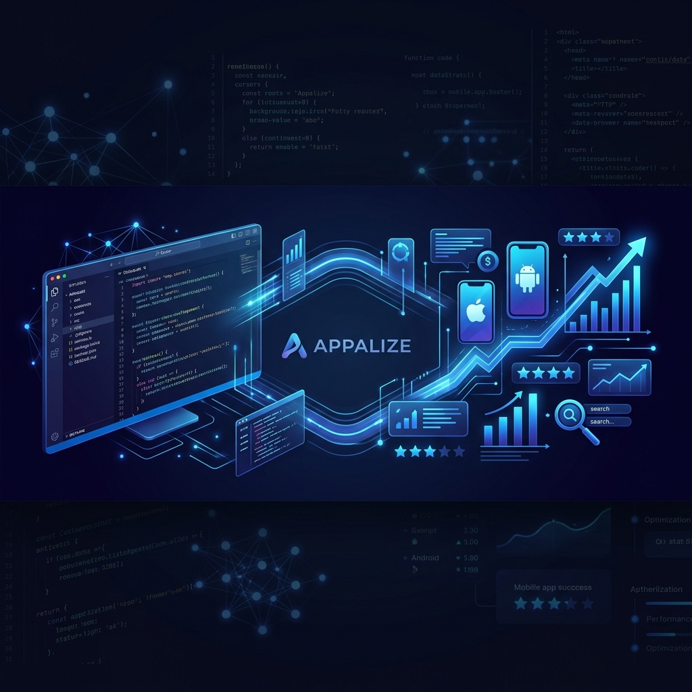

<a href="https://www.appalize.com?utm_source=aso_skills&utm_medium=github&utm_campaign=readme&utm_content=hero_banner">
  
</a>
<div align="center">
<h3>🚀 AI Agent Skills for App Store Optimization</h3>
<p>Expert-level ASO guidance directly in your IDE — powered by <a href="https://www.appalize.com?utm_source=aso_skills&utm_medium=github&utm_campaign=readme&utm_content=subtitle_link">Appalize</a></p>

<p align="center">
  <a href="https://www.appalize.com?utm_source=aso_skills&utm_medium=github&utm_campaign=readme&utm_content=badge_platform">
    
  </a>
  <a href="https://x.com/appalizeDev">
    
  </a>
  <a href="https://github.com/appalize/aso-skills">
    
  </a>
</p>

<p>
  <a href="https://github.com/appalize/aso-skills/stargazers"></a>
  <a href="https://github.com/appalize/aso-skills/network/members"></a>
  <a href="LICENSE"></a>
</p>
</div>

---

AI agent skills for **App Store Optimization (ASO)** and mobile app marketing. Built for indie developers, app marketers, and growth teams who want **Cursor**, **Claude Code**, or any [Agent Skills](https://agentskills.io)-compatible AI assistant to help with keyword research, metadata optimization, competitor analysis, market intelligence, and app growth.

Powered by real App Store data via the [Appalize API & MCP Server](https://www.appalize.com/docs?utm_source=aso_skills&utm_medium=github&utm_campaign=readme&utm_content=intro_docs_link).

A full web platform is also available with AI-powered ASO tools, keyword research dashboard, competitor tracking, and more: **[appalize.com](https://www.appalize.com?utm_source=aso_skills&utm_medium=github&utm_campaign=readme&utm_content=intro_platform_link)**

## Why This Exists

Most ASO knowledge lives in blog posts, courses, and expensive consultants. We packaged it into **skills that any AI agent can use** — so you get expert-level ASO guidance directly in your IDE.

Each skill contains battle-tested frameworks, scoring rubrics, and output templates. The agent reads the skill, pulls real data from the App Store (via Appalize), and gives you **actionable recommendations — not generic advice**.

> **Built by the team behind [Appalize](https://www.appalize.com?utm_source=aso_skills&utm_medium=github&utm_campaign=readme&utm_content=callout_link)** — the enterprise-grade ASO platform trusted by app developers worldwide for keyword research, metadata optimization, competitor analysis, and growth analytics.

## Quick Start

**Cursor** — Settings (Cmd+Shift+J) → Rules → Add Rule → Remote Rule (Github) → paste `https://github.com/appalize/aso-skills`

**Claude Code** — `npx skills add appalize/aso-skills`

**Manual** — `git clone https://github.com/appalize/aso-skills.git && cp -r aso-skills/skills/* .cursor/skills/`

Then ask your agent:

```
"Run an ASO audit for my app (id: 1617391485)"
"Find the best keywords for a meditation app"
"Optimize my App Store title and subtitle"
"How many downloads do I need to reach top 10 in Health & Fitness?"
"What apps are rising in the charts right now?"
"Give me a market briefing for the Games category"
"How are my downloads and revenue trending this month?"
"Help me plan a Christmas In-App Event"
"What seasonal keywords should I add in December?"
"Optimize my Google Play listing"
"My app rating dropped — how do I recover it?"
"Set up a weekly competitor monitoring routine for apps X, Y, Z"
"Help me pitch TechCrunch for my app launch"
"Build an Apple Search Ads campaign structure for my fitness app"
"My app has a crash affecting 2% of sessions — help me triage it"
```

Or invoke directly: `/aso-audit`, `/keyword-research`, `/metadata-optimization`, `/market-movers`, `/market-pulse`, `/asc-metrics`, `/in-app-events`, `/seasonal-aso`, `/android-aso`, `/apple-search-ads`, `/competitor-tracking`

## 📦 Skills Library

### ASO Core
| Skill | What it does |
|-------|-------------|
| [`aso-audit`](skills/aso-audit) | Scores your listing across 10 factors (0-100), flags problems, gives a prioritized fix list |
| [`keyword-research`](skills/keyword-research) | Finds keywords by volume × difficulty × relevance, groups them into primary/secondary/long-tail |
| [`metadata-optimization`](skills/metadata-optimization) | Writes title, subtitle, keyword field, description — with 3 variants and character counts |
| [`competitor-analysis`](skills/competitor-analysis) | Keyword gaps, creative teardown, positioning map, and specific opportunities to exploit |
| [`seasonal-aso`](skills/seasonal-aso) | Seasonal keyword calendar, metadata swap strategy, timing checklist, and trending-moment tactics |
| [`android-aso`](skills/android-aso) | Google Play-specific ASO — indexed description strategy, short description, Play Experiments, rating recovery |

### Creative & International
| Skill | What it does |
|-------|-------------|
| [`screenshot-optimization`](skills/screenshot-optimization) | 10-slot screenshot strategy with design briefs, text overlay copy, and competitor audit |
| [`app-icon-optimization`](skills/app-icon-optimization) | Icon design principles, A/B testing via PPO/Play Experiments, category differentiation, and icon briefs |
| [`review-management`](skills/review-management) | Sentiment analysis, response templates (HEAR framework), rating improvement tactics |
| [`localization`](skills/localization) | Market prioritization matrix, per-country keyword research, cultural adaptation checklist |

### Growth
| Skill | What it does |
|-------|-------------|
| [`app-launch`](skills/app-launch) | 8-week launch timeline with daily checklists, channel strategy, and press outreach templates |
| [`ua-campaign`](skills/ua-campaign) | Apple Search Ads, Meta, Google UAC — campaign structure, bidding, creative specs, budget allocation |
| [`apple-search-ads`](skills/apple-search-ads) | Deep-dive ASA — campaign structure, match types, CPP routing, bid strategy, weekly optimization checklist |
| [`app-store-featured`](skills/app-store-featured) | Featuring readiness score, Apple tech checklist, pitch template, In-App Events calendar |
| [`in-app-events`](skills/in-app-events) | Plan and write App Store In-App Events — copy, image brief, keyword strategy, submission timeline |
| [`app-clips`](skills/app-clips) | App Clip use cases, card design, URL scheme setup, SKOverlay handoff, and measurement |
| [`press-and-pr`](skills/press-and-pr) | Media targeting tiers, pitch templates, press kit checklist, embargo strategy, Product Hunt launch |

### Revenue & Retention
| Skill | What it does |
|-------|-------------|
| [`monetization-strategy`](skills/monetization-strategy) | Pricing tiers, paywall timing/design, trial optimization, category benchmarks |
| [`subscription-lifecycle`](skills/subscription-lifecycle) | Trial nurture sequences, voluntary/involuntary churn reduction, dunning, and win-back campaigns |
| [`retention-optimization`](skills/retention-optimization) | Activation → habit → engagement framework, push notification sequences, churn prevention |
| [`onboarding-optimization`](skills/onboarding-optimization) | First-run flow audit, activation event definition, permission prompt timing, sign-up friction reduction |
| [`rating-prompt-strategy`](skills/rating-prompt-strategy) | SKStoreReviewRequest / Play In-App Review timing, pre-prompt survey, version-gating, and rating recovery |

### Analytics & Testing
| Skill | What it does |
|-------|-------------|
| [`app-analytics`](skills/app-analytics) | Event tracking plan, dashboard setup, KPI framework with category benchmarks |
| [`ab-test-store-listing`](skills/ab-test-store-listing) | Hypothesis → variant design → sample size → interpretation for App Store A/B tests |
| [`asc-metrics`](skills/asc-metrics) | Analyze your exact App Store Connect data (downloads, revenue, subscriptions, countries) via Appalize |
| [`crash-analytics`](skills/crash-analytics) | Crashlytics setup, crash triage framework (P0–P3), symbolication, phased release strategy, rating recovery |

### Market Intelligence
| Skill | What it does |
|-------|-------------|
| [`market-movers`](skills/market-movers) | Identifies top chart gainers/losers, new entries, and dropped apps — explains what's driving changes |
| [`market-pulse`](skills/market-pulse) | Full market briefing: chart movements + trending keywords + featured apps + new launches in one view |
| [`competitor-tracking`](skills/competitor-tracking) | Weekly competitor surveillance — metadata changes, keyword shifts, rating trends, chart movement deltas |

### Foundation
| Skill | What it does |
|-------|-------------|
| [`app-marketing-context`](skills/app-marketing-context) | Creates a context doc (app, audience, competitors, goals) that all other skills reference |

## 🔄 How It Works

```
You: "Run an ASO audit for Headspace"

Agent:
  1. Reads aso-audit/SKILL.md (framework, scoring rubric, output template)
  2. Calls Appalize API → fetches metadata, keywords, ratings, competitors
  3. Scores each factor (title: 8/10, subtitle: 6/10, keywords: 4/10...)
  4. Returns: ASO Score Card + Quick Wins + High-Impact Changes + Strategic Recs
```

Skills reference each other — `aso-audit` might suggest running `keyword-research` for deeper analysis, which then feeds into `metadata-optimization` for implementation.

## 🛠 Setup

### Cursor
| Method | Command |
|--------|---------|
| GitHub Import | Settings → Rules → Add Rule → Remote Rule → `https://github.com/appalize/aso-skills` |
| Project-level | `cp -r aso-skills/skills/* .cursor/skills/` |
| Global | `cp -r aso-skills/skills/* ~/.cursor/skills/` |

### Claude Code
| Method | Command |
|--------|---------|
| CLI | `npx skills add appalize/aso-skills` |
| Specific skills | `npx skills add appalize/aso-skills --skill aso-audit keyword-research` |
| Manual | `cp -r aso-skills/skills/* .claude/skills/` |

### Any Agent
```bash
git submodule add https://github.com/appalize/aso-skills.git .agents/aso-skills
```

Works with any tool that supports the [Agent Skills](https://agentskills.io) standard (`.agents/skills/`, `.cursor/skills/`, `.claude/skills/`, `.codex/skills/`).

## 🔌 Appalize Integration

Skills work standalone with general ASO knowledge. Connect [Appalize](https://www.appalize.com/docs?utm_source=aso_skills&utm_medium=github&utm_campaign=readme&utm_content=integration_docs) for real-time App Store data:

```json
{
  "mcpServers": {
    "appalize": {
      "url": "https://mcp.appalize.com/mcp",
      "headers": { "Authorization": "Bearer apz_your_key_here" }
    }
  }
}
```

With Appalize connected, skills can pull live keyword rankings, competitor metadata, download estimates, trending keywords, and featured apps.

### Appalize Connect — Your Own ASC Data

The `asc-metrics` skill uses **Appalize Connect**, an integration that syncs your exact App Store Connect data (downloads, revenue, subscriptions, trials, IAP, and country breakdowns) into Appalize nightly.

Connect once at [appalize.com → Settings → Integrations](https://www.appalize.com/settings?utm_source=aso_skills&utm_medium=github&utm_campaign=readme&utm_content=asc_connect_link) and then ask:

```
"How are my downloads trending this month?"
"What are my top 5 markets by revenue?"
"Compare this month's subscriptions to last month"
```

See [tools/integrations/appalize-connect.md](tools/integrations/appalize-connect.md) for the full API reference.

See [tools/REGISTRY.md](tools/REGISTRY.md) for the full capability matrix.

## 🌟 Why Appalize?

| Feature | Appalize | Others |
|---------|----------|--------|
| **AI-Powered ASO** | ✅ Multi-model AI (GPT-4, Claude, Gemini) | Basic or no AI |
| **Real-time Keyword Data** | ✅ Live rankings & volume | Delayed updates |
| **App Store Connect Sync** | ✅ Exact first-party data | Estimates only |
| **Competitor Intelligence** | ✅ Deep analysis & tracking | Surface-level |
| **Chrome Extension** | ✅ Store Helper for ASC | N/A |
| **Agent Skills** | ✅ This repo — works in any IDE | N/A |
| **MCP Server** | ✅ Native integration | Limited |

**[Start your free trial →](https://app.appalize.com/register?utm_source=aso_skills&utm_medium=github&utm_campaign=readme&utm_content=cta_free_trial)**

## Contributing

PRs welcome — fix an inaccuracy, improve a framework, or add a new skill. See [CONTRIBUTING.md](CONTRIBUTING.md).

## License

MIT — see [LICENSE](LICENSE).

---

<div align="center">
  <p>
    <strong>Built with ❤️ by the <a href="https://www.appalize.com?utm_source=aso_skills&utm_medium=github&utm_campaign=readme&utm_content=footer_link">Appalize</a> team</strong>
  </p>
  <p>
    <a href="https://www.appalize.com?utm_source=aso_skills&utm_medium=github&utm_campaign=readme&utm_content=footer_website">Website</a> •
    <a href="https://www.appalize.com/docs?utm_source=aso_skills&utm_medium=github&utm_campaign=readme&utm_content=footer_docs">Documentation</a> •
    <a href="https://x.com/appalizeDev">Twitter</a> •
    <a href="https://github.com/appalize/aso-skills/discussions">Discussions</a>
  </p>
</div>
